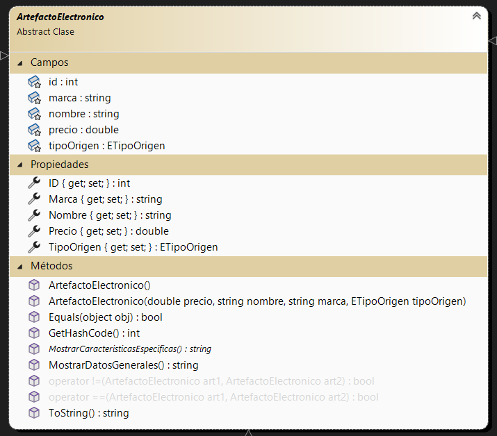

# Presentación segundo parcial Laboratorio 2

Me llamo Francisco Martínez Balian, tengo 19 años y aspiro a ser un gran programador. Me emociona mucho la idea de poder ayudar a las personas con la tecnología, ya sea con un programa, una aplicacion o con un robot. Destaco esto ultimo, porque siempre me fascinó la idea de que la tecnologia pueda ayudar a las personas que lo necesiten. Me anote en esta tecnicatura, porque siento que el ínico límite es la imaginación, lo que te imagines es posible si lo sabés programar.

# Título: CRUD - Empresa electrónica

# Funcionamiento
Este CRUD representa una aplicación diseñada para una empresa de productos electrónicos. Permite agregar, modificar y eliminar distintos elementos electrónicos de la lista y de la base de datos, y no permite agregar dos productos iguales para evitar confusiones (no pueden tener ni el mismo nombre ni el mismo precio). Además, permite ordenar la lista, tanto por sus nombres como por sus precios, tiene un botón para mostrar las características específicas de cada producto por si se quiere saber más de este y por último, contiene un visualizador, para ver un registro de quienes se loguearon.
Dependiendo del perfil de quien se loguee, tendrá disponibles ciertas funcionalidad y otras estarán bloqueadas.

# Diagrama esquemático - Testeo

# Diagrama esquemático - Clases generales

# Diagrama esquemático - Artefacto electrónico

# Diagrama esquemático - Celular

# Diagrama esquemático - Computadora

# Diagrama esquemático - Consola

# Diagrama esquemático - Otras clases

# Diagrama esquemático - Formularios general

# Diagrama esquemático - Empresa y login

# Diagrama esquemático - Otros formularios

